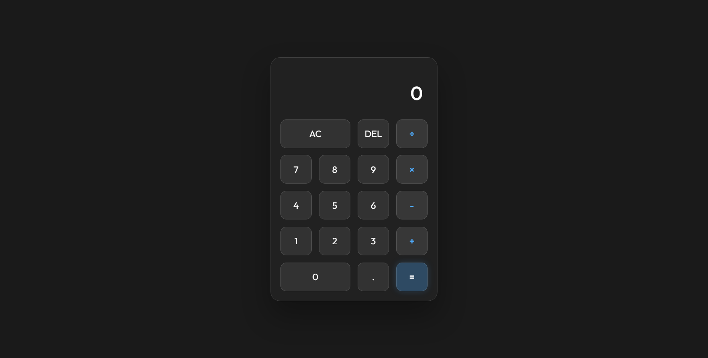

# Liquid Glass Calculator ✨

A sleek front-end project crafted with love using HTML, CSS, and pure JavaScript.

## 🚀 Live Demo

Experience the site live at 👉 [S00N](#)

## Demo Preview 📸  


## Description 📝  
A modern, minimal calculator application featuring a "Liquid Glass" (Glassmorphism) aesthetic. Designed to be visually pleasing with a solid dark background and frosted glass effects, fully responsive for all devices.

## Features 🔥  

| Feature               | Description                                                               |
| --------------------- | ------------------------------------------------------------------------- |
| **Liquid Glass UI**   | Minimalist glassmorphism design with a clean dark theme 🎨                 |
| **Responsive Design** | Works seamlessly on mobile, tablet, and desktop 💻📱                        |
| **Safe Math Logic**   | Handles basic arithmetic and errors (e.g., division by zero) gracefully 🧮 |
| **Pure Vanilla JS**   | No external frameworks or dependencies, just pure performance ⚡           |

## Tech Stack 🛠️  
-   
-   
-   

## Installation 🚀  
1. Clone it:  
   ```bash
   git clone https://github.com/EmadN87-dev/liquid-glass-calculator.git
   ```
2. Open `index.html` in your browser. No dependencies needed!  

## Usage 🎮  
Run locally by opening the file. Tweak the glass effects in `css/style.css` to customize the look.  

## License ⚖️  
MIT License - See [LICENSE](LICENSE) for details.
